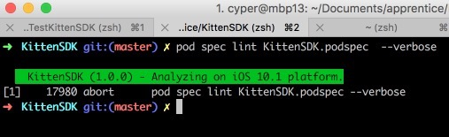

My exercise for this excellent tutorial: [Publish a Universal Binary iOS Framework in Swift using CocoaPods][1]

post-action scripts: https://gist.github.com/eladnava/0824d08da8f99419ef2c7b7fb6d4cc78

我写好的KittenSDK使用pod install在其它项目中一直安装失败, 后来找资料说需要检查podspec, `pod spec lint KittenSDK.podspec --verbose`始终失败,如下:



开始以为是podspec的问题, 后来我把Alamofile的源代码下下来, pod spec lint都报相同的错误!! 

解决办法:

`sudo gem install cocoapods --pre`将pod升级最新的`1.2.0.beta.1`, 这回全部正常了.

```sh
sudo gem install cocoapods --pre
pod --version
pod update
pod spec create KittenSDK
pod spec lint KittenSDK.podspec --verbose
zip -r dist/1.0.0/KittenSDK.zip LICENSE KittenSDK.framework
```

[1]: https://eladnava.com/publish-a-universal-binary-ios-framework-in-swift-using-cocoapods/
